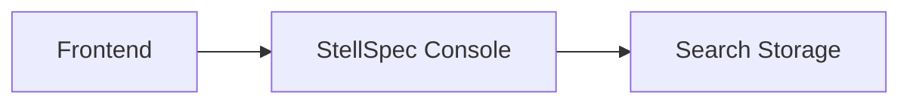

# StellSpec Console

`stellspec-console` 是 StellSpec 日志平台的查询控制面服务，面向前端控制台提供日志查询、结果归一和状态检查能力。

## 项目概述

本项目负责读取由 `stellspec-service` 写入的日志数据，并为前端应用提供统一查询 API。它应保持只读定位，与日志摄取链路解耦。

## 当前状态

| 项目 | 说明 |
| --- | --- |
| 稳定性 | 开发中 |
| 服务类型 | 日志查询控制面 |
| 技术栈 | Java、Spring Boot、Stellflux |
| 维护方 | StellHub |

## 解决什么问题

- 为前端控制台提供日志查询 API。
- 执行日志数据查询并返回标准结果。
- 将查询服务与写入服务解耦。
- 提供状态检查接口。

## 不解决什么问题

- 不负责日志采集和写入。
- 不直接实现前端页面。
- 不替代底层搜索存储。

## 核心能力

| 能力 | 说明 |
| --- | --- |
| 查询 API | 面向前端提供查询入口 |
| 结果归一 | 返回统一事件结果 |
| 只读控制面 | 与写入链路隔离 |
| 状态检查 | 暴露运行状态 |

## 架构说明



## 快速开始

```bash
mvn clean test
mvn clean package -DskipTests
mvn spring-boot:run
```

## 配置说明

| 配置项 | 是否必填 | 说明 |
| --- | --- | --- |
| server.port | 否 | HTTP 服务端口 |
| search.endpoint | 是 | 搜索存储地址 |
| stellspec.query.timeout | 否 | 查询超时时间 |

## 本地开发

```bash
mvn clean verify
```

## 版本与升级

- `MAJOR`：不兼容 API 或返回结构变更。
- `MINOR`：向后兼容的新能力。
- `PATCH`：向后兼容的问题修复。

## 可观测性

| 类型 | 名称 | 说明 |
| --- | --- | --- |
| Metric | stellspec_query_total | 查询次数 |
| Metric | stellspec_query_latency | 查询耗时 |
| Log | QUERY_FAILED | 查询失败 |

## 故障排查

### 前端查询无结果

1. 检查搜索存储地址是否可访问。
2. 检查查询条件是否正确。
3. 检查写入服务是否已经产生数据。

## 安全说明

生产环境配置不应直接提交到仓库，查询接口应按平台规范接入统一访问控制。

## 目录结构

```text
.
├── src/            # 服务源码
├── docs/           # 扩展文档
├── pom.xml         # Maven 构建文件
└── README.md       # 项目说明
```

## 贡献规范

- API 返回结构变更必须说明兼容性影响。
- 查询逻辑变更必须补充测试。
- 行为变更必须同步更新 README 或 docs。

## 支持

由 StellHub 维护。建议通过 GitHub Issues 记录问题、需求和设计讨论。

## 许可证

以仓库内 `LICENSE` 文件为准。